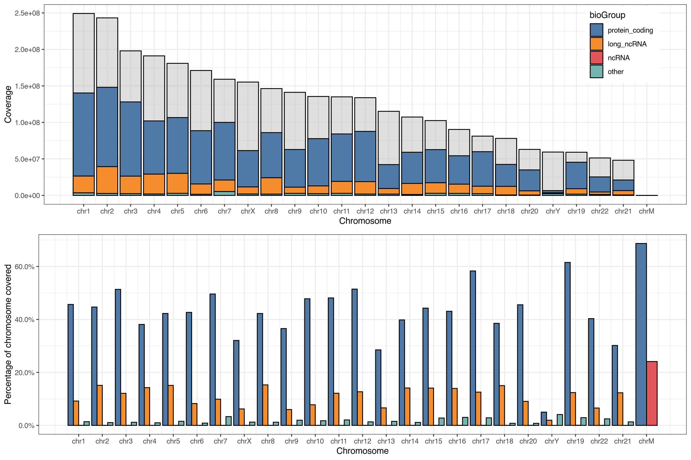

```{r setupEnv, include=FALSE}
working.folder = "./"

knitr::opts_knit$set(root.dir = working.folder)
knitr::opts_chunk$set(echo = FALSE)

if( interactive() )
    setwd(working.folder)

species = "Homo sapiens" # or 'Mus musculus' for mouse
genome = "hg19" # or mm10 for mouse
version = "19" # or M16 for mouse
```

## To-Do

- Merge the rRNA (and Mt_RNA) genes from the main annotation with the predicted tRNA genes

## Setup

```{r sessionInfo, echo=FALSE}
cat(sessionInfo()$R.version$version.string, fill=TRUE)
cat(paste("Platform", sessionInfo()$platform), fill=TRUE)
cat(paste("Running under", sessionInfo()$running), fill=TRUE)
cat(paste("Last knitted on", date()), fill=TRUE)
cat(paste("Species: ", species), fill=TRUE)
cat(paste("Genome assembly:", genome), fill=TRUE)
cat(paste("Gencode version:", version), fill=TRUE)
```

If any of the information above does not suit your needs, please review it in the 'setup' chunk  and re-run the script.

```{r loadPackages, message=FALSE, results="hide"}
require("AnnotationHub")
require("biomaRt")
require("GenomicFeatures")
require("rtracklayer")
require("data.table")
require("knitr")
require("ggplot2")
require("ggpubr")
require("ggthemes")
require("scales")
```

## Gencode Annotation (GFF3) 

### Input

If they are not present in the working folder, the pipeline will download the following files:

- __Comprehensive gene annotation__: It contains the comprehensive gene annotation on the reference chromosomes only.
- __Long non-coding RNA gene annotation__: It contains the comprehensive gene annotation of lncRNA genes on the reference chromosomes (this is a subset of the main annotation file);
- __Predicted tRNA genes__: tRNA genes predicted by ENSEMBL on the reference chromosomes using tRNAscan-SE (this dataset does not form part of the main annotation file);
- __Chromosome sizes__: The file contains the size in nucleorides of each chromosome.

```{r downloadGencode, results="hide", message=FALSE, warning=FALSE}
if( species %in% "Homo sapiens" ){
    if( !file.exists(paste0("gencode.v", version, ".annotation.gff3.gz")) )
        download.file(paste0("ftp://ftp.ebi.ac.uk/pub/databases/gencode/Gencode_human/release_", version, "/gencode.v", version, ".annotation.gff3.gz"),
                      file.path(working.folder, gsub(" ", "_", species), genome, paste0("gencode.v", version, ".annotation.gff3.gz")), quiet = TRUE)
    
    if( !file.exists(paste0("gencode.v", version, ".long_noncoding_RNAs.gff3.gz")) | !file.exists(paste0("gencode.v", version, ".long_noncoding_RNAs.gtf.gz")) )
        try.log = try(download.file(paste0("ftp://ftp.ebi.ac.uk/pub/databases/gencode/Gencode_human/release_", version, "/gencode.v", version, ".long_noncoding_RNAs.gff3.gz"),
                                    file.path(working.folder, gsub(" ", "_", species), genome, paste0("gencode.v", version, ".long_noncoding_RNAs.gff3.gz")), quiet = TRUE), silent=TRUE)
    if( is(try.log) == "try-error")
        download.file(paste0("ftp://ftp.ebi.ac.uk/pub/databases/gencode/Gencode_human/release_", version, "/gencode.v", version, ".long_noncoding_RNAs.gtf.gz"),
                      file.path(working.folder, gsub(" ", "_", species), genome, paste0("gencode.v", version, ".long_noncoding_RNAs.gtf.gz")), quiet = TRUE)
    
    if( !file.exists(paste0("gencode.v", version, ".tRNAs.gff3.gz")) | !file.exists(paste0("gencode.v", version, ".tRNAs.gtf.gz")) )
        try.log = try(download.file(paste0("ftp://ftp.ebi.ac.uk/pub/databases/gencode/Gencode_human/release_", version, "/gencode.v", version, ".tRNAs.gff3.gz"),
                                    file.path(working.folder, gsub(" ", "_", species), genome, paste0("gencode.v", version, ".tRNAs.gff3.gz")), quiet = TRUE), silent=TRUE)
    if( is(try.log) == "try-error")
        download.file(paste0("ftp://ftp.ebi.ac.uk/pub/databases/gencode/Gencode_human/release_", version, "/gencode.v", version, ".tRNAs.gtf.gz"),
                      file.path(working.folder, gsub(" ", "_", species), genome, paste0("gencode.v", version, ".tRNAs.gtf.gz")), quiet = TRUE)
    
    if( !file.exists(paste0(genome, ".chrom.sizes")) )
        download.file(paste0("http://hgdownload.soe.ucsc.edu/goldenPath/", genome, "/bigZips/", genome, ".chrom.sizes"),
                      file.path(working.folder, gsub(" ", "_", species), genome, paste0(genome, ".chrom.sizes")), quiet = TRUE)
}else{
    if( !file.exists(paste0("gencode.v", version, ".annotation.gff3.gz")) )
        download.file(paste0("ftp://ftp.ebi.ac.uk/pub/databases/gencode/Gencode_mouse/release_", version, "/gencode.v", version, ".annotation.gff3.gz"),
                      file.path(working.folder, gsub(" ", "_", species), genome, paste0("gencode.v", version, ".annotation.gff3.gz")), quiet = TRUE)
    
    if( !file.exists(paste0("gencode.v", version, ".long_noncoding_RNAs.gff3.gz")) )
        download.file(paste0("ftp://ftp.ebi.ac.uk/pub/databases/gencode/Gencode_mouse/release_", version, "/gencode.v", version, ".long_noncoding_RNAs.gff3.gz"),
                      file.path(working.folder, gsub(" ", "_", species), genome, paste0("gencode.v", version, ".long_noncoding_RNAs.gff3.gz")), quiet = TRUE)
    
    if( !file.exists(paste0("gencode.v", version, ".tRNAs.gff3.gz")) )
        download.file(paste0("ftp://ftp.ebi.ac.uk/pub/databases/gencode/Gencode_mouse/release_", version, "/gencode.v", version, ".tRNAs.gff3.gz"),
                      file.path(working.folder, gsub(" ", "_", species), genome, paste0("gencode.v", version, ".tRNAs.gff3.gz")), quiet = TRUE)
    
    if( !file.exists(paste0(genome, ".chrom.sizes")) )
        download.file(paste0("http://hgdownload.soe.ucsc.edu/goldenPath/", genome, "/bigZips/", genome, ".chrom.sizes"),
                      file.path(working.folder, gsub(" ", "_", species), genome, paste0(genome, ".chrom.sizes")), quiet = TRUE)
}
```

__Note__: the pipeline will search for the genome assembly and Gencode annotation versions specified within the script. Therefore, if you plan to use a different species/assembly/annotation make sure you change the script accordingly. 

```{r readAnnotation, message=FALSE, warning=FALSE}
chromosomes = genomeStyles()[[gsub(" ", "_", species)]]$UCSC
chrominfo = sortSeqlevels(with(fread(file.path(working.folder, gsub(" ", "_", species), genome, paste0(genome, ".chrom.sizes")))[V1%in%chromosomes,],
                               Seqinfo(V1, seqlengths = V2, genome = genome)))

if( !file.exists(file.path(working.folder, gsub(" ", "_", species), genome, paste0(genome, "_Gencode", version, ".sqlite"))) ){
    TxDb = makeTxDbFromGFF(file = file.path(working.folder, gsub(" ", "_", species), genome, paste0("gencode.v", version, ".annotation.gff3.gz")),
                           format = "gff3",
                           dataSource = paste("Gencode version", version),
                           organism = species,
                           chrominfo = chrominfo)
    saveDb(TxDb, file=file.path(working.folder, gsub(" ", "_", species), genome, paste0(genome, "_Gencode", version, ".sqlite")))
}else{
    TxDb = loadDb(file=file.path(working.folder, gsub(" ", "_", species), genome, paste0(genome, "_Gencode", version, ".sqlite")))
}

gff = import.gff3(file.path(working.folder, gsub(" ", "_", species), genome, paste0("gencode.v", version, ".annotation.gff3.gz")))
seqinfo(gff) = chrominfo

# Remove the duplicated genes on the chromosome Y
x.genes = unique(gff[seqnames(gff)%in%"chrX"]$gene_id)
y.genes = unique(gff[seqnames(gff)%in%"chrY"]$gene_id)
y.genes = y.genes[y.genes%in%x.genes]
gff = gff[!(seqnames(gff)%in%"chrY" & gff$gene_id%in%y.genes)]

# # Remove the ribosomal RNA genes
# ribo.gff = gff[gff$gene_type%in%"rRNA",]
# gff = gff[!gff$gene_type%in%"rRNA",]

if( file.exists(file.path(working.folder, gsub(" ", "_", species), genome, paste0("gencode.v", version, ".long_noncoding_RNAs.gff3.gz"))) ){
    lnc.gff = import.gff3(file.path(working.folder, gsub(" ", "_", species), genome, paste0("gencode.v", version, ".long_noncoding_RNAs.gff3.gz")))
}else{
    lnc.gff = import.gff2(file.path(working.folder, gsub(" ", "_", species), genome, paste0("gencode.v", version, ".long_noncoding_RNAs.gtf.gz")))
}
seqinfo(lnc.gff) = chrominfo

# Remove the duplicated genes on the chromosome Y
x.genes = unique(lnc.gff[seqnames(lnc.gff)%in%"chrX"]$gene_id)
y.genes = unique(lnc.gff[seqnames(lnc.gff)%in%"chrY"]$gene_id)
y.genes = y.genes[y.genes%in%x.genes]
lnc.gff = lnc.gff[!(seqnames(lnc.gff)%in%"chrY" & lnc.gff$gene_id%in%y.genes)]
```

##### Table 1: Gene biotypes (top 20) per annotation level

```{r}
tab = data.table(as.data.frame(gff))[type%in%"gene", .N, by=c("gene_type", "level")]

tab = dcast.data.table(tab, gene_type~level, value.var="N", fill=0)[order(-(`1`+`2`+`3`))]

setnames(tab, "gene_type", "Biotype")

kable(head(data.frame(tab), 10), col.names=colnames(tab), format='markdown', digits=1,
      caption="Table 1: Gene biotypes (top 10) per annotation level.")
```

```{r extractMetadata}
# Genes, transcripts and exons
genes = genes(TxDb)
genes = genes[!grepl("PAR", names(genes)),]
txs = transcriptsBy(TxDb, by="gene")
txs = txs[!grepl("PAR", names(txs)),]
exons = exonsBy(TxDb, by="tx", use.names=TRUE)
exons = exons[!grepl("PAR", names(exons)),]

# Gene biotypes
bio.names = names(sort(table(gff[gff$type%in%"gene"]$gene_type), decreasing=TRUE))
geneBT = lapply(bio.names,
                function(x)
                    unique(gff$gene_id[gff$gene_type%in%x]) )
names(geneBT) = bio.names

gene.metadata = data.table(as.data.frame(gff))[type%in%"gene", 
                                               list(gene_id, gene_type, gene_name, level, seqnames, start, end, width, strand)]

# Transcripts biotypes
bio.names = names(sort(table(gff[gff$type%in%"transcript"]$transcript_type), decreasing=TRUE))
txsBT =  lapply(bio.names,
                function(x) unique(gff$transcript_id[gff$transcript_type%in%x]) )
names(txsBT) = bio.names

txs.metadata = data.table(as.data.frame(gff))[type%in%"transcript",
                                              list(transcript_id, transcript_type, gene_id, gene_type, gene_name, level, seqnames, start, end, width, strand)]

if( !dir.exists(file.path(working.folder, gsub(" ", "_", species), genome, "RData")) )
    dir.create(file.path(working.folder, gsub(" ", "_", species), genome, "RData"), recursive = TRUE)

save(genes, gene.metadata, file=file.path(working.folder, gsub(" ", "_", species), genome, "RData", paste0(genome, "_Gencode", version, "_genes_annotations_minimal.RData")))
save(txs, txs.metadata, file=file.path(working.folder, gsub(" ", "_", species), genome,  "RData", paste0(genome, "_Gencode", version, "_txs_annotations_minimal.RData")))
```

The _Comprehensive gene annotation_ file is employed to extract information on genes, transcripts and exons, while the _Long non-coding RNA gene annotation_ is used to include additional non-coding RNAs (assigned as such by Gencode) to those predicted using sequences from [Rfam](http://rfam.xfam.org/) and [miRBase](http://www.mirbase.org/).

By default, the analysis is restricted to standard chromosome only, and to level 1 (validated), 2 (manual annotation) and 3 (automated annotation) genes.

```{r longestGeneTxs}
# GRanges of protein-coding and ncRNA genes
protein.coding = names(geneBT)%in%c("protein_coding",
                                    paste(rep(c("IG","TR"), each=4), c("C","D","J","LV","V"), "gene", sep="_"))
protein.coding = as.vector(unlist(geneBT[protein.coding]))
genes.pc.granges = genes[names(genes) %in% protein.coding,]

ncRNA = unique(c(grep("RNA", names(geneBT), value=TRUE), "ribozyme",
                 unique(lnc.gff[lnc.gff$type%in%"gene"]$gene_type)))
ncRNA = as.vector(unlist(geneBT[ncRNA]))
genes.nc.granges = genes[names(genes) %in% ncRNA,]

# Get the transcript lengths
txs.length = transcriptLengths(TxDb, with.cds_len=TRUE, with.utr5_len=TRUE, with.utr3_len=TRUE)
protein.coding = names(txsBT) %in% c("protein_coding",
                                     paste(rep(c("IG","TR"), each=4), c("C","D","J","V"), "gene", sep="_"))
protein.coding = as.vector(unlist(txsBT[protein.coding]))
txs.length.pc = txs.length[txs.length$tx_name %in% protein.coding,]

ncRNA = unique(c(grep("RNA", names(txsBT), value=TRUE), "ribozyme",
                 unique(lnc.gff[lnc.gff$type%in%"gene"]$gene_type)))
ncRNA = as.vector(unlist(txsBT[ncRNA]))
txs.length.nc = txs.length[txs.length$tx_name %in% ncRNA,]

# Order by size
txs.length.pc = txs.length.pc[order(txs.length.pc$tx_len, decreasing=TRUE),]
txs.length.nc = txs.length.nc[order(txs.length.nc$tx_len, decreasing=TRUE),]

# Keep only the longest transcript per gene
txs.longest.pc = txs.length.pc[!duplicated(txs.length.pc$gene_id),]
txs.longest.nc = txs.length.nc[!duplicated(txs.length.nc$gene_id),]

# GRanges of protein-coding and ncRNA transcripts
txs.longest.pc.pre.granges = unlist(txs)
txs.longest.pc.pre.granges = txs.longest.pc.pre.granges[txs.longest.pc.pre.granges$tx_name %in% txs.longest.pc$tx_name,]
mcols(txs.longest.pc.pre.granges) = txs.longest.pc[match(txs.longest.pc.pre.granges$tx_name, txs.longest.pc$tx_name),]
names(txs.longest.pc.pre.granges) = NULL
txs.longest.pc.pre.granges = split(txs.longest.pc.pre.granges, txs.longest.pc.pre.granges$gene_id)

txs.longest.nc.pre.granges = unlist(txs)
txs.longest.nc.pre.granges = txs.longest.nc.pre.granges[txs.longest.nc.pre.granges$tx_name %in% txs.longest.nc$tx_name,]
mcols(txs.longest.nc.pre.granges) = txs.longest.nc[match(txs.longest.nc.pre.granges$tx_name, txs.longest.nc$tx_name),]
names(txs.longest.nc.pre.granges) = NULL
txs.longest.nc.pre.granges = split(txs.longest.nc.pre.granges, txs.longest.nc.pre.granges$gene_id)

# GRanges of protein-coding and ncRNA transcripts
# Including the intronic regions (pre-RNA)
txs.longest.pc.rna.granges = unlist(exons)
txs.longest.pc.rna.granges = txs.longest.pc.rna.granges[names(txs.longest.pc.rna.granges) %in% txs.longest.pc$tx_name,]
mcols(txs.longest.pc.rna.granges) = cbind(mcols(txs.longest.pc.rna.granges), txs.longest.pc[match(names(txs.longest.pc.rna.granges), txs.longest.pc$tx_name),])
names(txs.longest.pc.rna.granges) = NULL
txs.longest.pc.rna.granges = split(txs.longest.pc.rna.granges, txs.longest.pc.rna.granges$gene_id)

# Excluding the intronic regions (RNA)
txs.longest.nc.rna.granges = unlist(exons)
txs.longest.nc.rna.granges = txs.longest.nc.rna.granges[names(txs.longest.nc.rna.granges) %in% txs.longest.nc$tx_name,]
mcols(txs.longest.nc.rna.granges) = cbind(mcols(txs.longest.nc.rna.granges), txs.longest.nc[match(names(txs.longest.nc.rna.granges), txs.longest.nc$tx_name),])
names(txs.longest.nc.rna.granges) = NULL
txs.longest.nc.rna.granges = split(txs.longest.nc.rna.granges, txs.longest.nc.rna.granges$gene_id)

exonsByGene = exonsBy(TxDb, by="gene")
# Remove duplicated exon entries within individual genes
exonsByGene = exonsByGene[!duplicated(exonsByGene)]
exonsByTxs = exonsBy(TxDb, by="tx", use.names=TRUE)

# Merge the coding exons for each protein-coding gene
temp = unlist(exonsByTxs[names(exonsByTxs) %in% protein.coding])
temp$gene_id = gff[match(names(temp), gff$transcript_id),]$gene_id
names(temp) = NULL
exons.pc.granges = reduce(split(temp, temp$gene_id))

# Merge the non-coding exons for each non-coding gene
temp = unlist(exonsByTxs[names(exonsByTxs) %in% ncRNA])
temp$gene_id = gff[match(names(temp), gff$transcript_id),]$gene_id
names(temp) = NULL
exons.nc.granges = reduce(split(temp, temp$gene_id))

save(genes, geneBT, gene.metadata, genes.pc.granges, genes.nc.granges, exonsByGene, exons.pc.granges, exons.nc.granges,
     file=file.path(working.folder, gsub(" ", "_", species), genome, "RData", paste0(genome, "_Gencode", version, "_genes_annotations.RData")))
save(txs, txsBT, txs.metadata, exonsByTxs, txs.longest.pc.pre.granges, txs.longest.nc.pre.granges, txs.longest.pc.rna.granges, txs.longest.nc.rna.granges,
     file=file.path(working.folder, gsub(" ", "_", species), genome,  "RData", paste0(genome, "_Gencode", version, "_txs_annotations.RData")))
```

### Output

- __&lt;genome&gt;\_Gencode&lt;version&gt;\_genes_annotations_minimal.RData__: It contains the basic annotation objects, including genes GRanges and metadata information.
- __&lt;genome&gt;\_Gencode&lt;version&gt;\_txs_annotations_minimal.RData__: It contains the basic annotation objects, including transcripts GRanges and metadata information.
- __&lt;genome&gt;\_Gencode&lt;version&gt;\_genes_annotations.RData__: In addition to the minimal object, it contains exons GRanges and separate protein-coding and non-coding genes and exons GRanges.
- __&lt;genome&gt;\_Gencode&lt;version&gt;\_txs_annotations.RData__: In addition to the minimal object, it contains exons GRanges and separate protein-coding and non-coding longest transcripts and exons GRanges. These are further divided into 'pre' (nascent)  and 'rna' (mature) transcripts.

- __&lt;genome&gt;\_Gencode&lt;version&gt;\_annotations.pc.transcript.regions.rds__: It contains protein-coding genes GRanges sub-divided into 5’-UTR, exonic and 3’-UTR regions.
- __&lt;genome&gt;\_Gencode&lt;version&gt;\_annotations.all.genes.transcript.regions.rds__: It contains all the annotated features, where each annotated nucleotide is assigned to a transcript biotype using the following hierarchy:
ncRNA &gt; cds &gt; utr3 &gt; utr5 &gt; intron &gt; other > intergenic

```{r}
if( !dir.exists(file.path(working.folder, gsub(" ", "_", species), genome, "img")) )
    dir.create(file.path(working.folder, gsub(" ", "_", species), genome, "img"))

tab = gene.metadata

bio_order = tab[, list(median=median(width)), by="gene_type"][order(-median), gene_type]

tab[, gene_type := factor(gene_type, bio_order)]

gg = ggplot(tab, aes(x=gene_type, y=width)) +
    ggtitle(paste("Genes width -", species, genome, version)) +
    geom_boxplot() +
    scale_y_log10("Gene width") +
    scale_x_discrete("") +
    theme_bw() + theme(axis.text.x=element_text(angle = 45, hjust = 1))
ggsave(gg, filename=file.path(working.folder, gsub(" ", "_", species), genome, "img/gene_length.png"), width=12, height=6)
ggsave(gg, filename=file.path(working.folder, "img/gene_length.png"), width=12, height=6)

tab = txs.metadata

bio_order = tab[, list(median=median(width)), by="gene_type"][order(-median), gene_type]

tab[, gene_type := factor(gene_type, bio_order)]

gg = ggplot(tab, aes(x=gene_type, y=width)) +
    ggtitle(paste("Transcripts width -", species, genome, version)) +
    geom_boxplot() +
    scale_y_log10("Transcript width") +
    scale_x_discrete("") +
    theme_bw() + theme(axis.text.x=element_text(angle = 45, hjust = 1))
ggsave(gg, filename=file.path(working.folder, gsub(" ", "_", species), genome, "img/txs_length.png"), width=12, height=6)
ggsave(gg, filename=file.path(working.folder, "img/txs_length.png"), width=12, height=6)
```

##### Figure 1: Gene length distribution


##### Figure 2: Trascript length distribution (Longest transcript per gene)


```{r codingGeneRegions}
cds = cdsBy(TxDb, by=c("tx"), use.names=TRUE)
cds = cds[!grepl("PAR", names(cds)),]
utr5 = fiveUTRsByTranscript(TxDb, use.names=TRUE)
utr5 = utr5[!grepl("PAR", names(utr5)),]
utr3 = threeUTRsByTranscript(TxDb, use.names=TRUE)
utr3 = utr3[!grepl("PAR", names(utr3)),]

txs.sel = txs.longest.pc$tx_name

# function to subset and unlist
convert <- function(gr, region){
    # select transcripts
    gr = gr[names(gr)%in%txs.sel]
    # add tx.id
    gr = unlist(gr)
    mcols(gr) = NULL
    mcols(gr)$tx.id = names(gr)
    names(gr) = NULL
    # add region type
    mcols(gr)$region = region
    return(gr)
}

txs.longest.pc.regions = c(convert(cds, "CDS"), convert(utr5, "UTR5"), convert(utr3, "UTR3"))

txs.longest.pc.regions = sort.GenomicRanges(txs.longest.pc.regions, ignore.strand=TRUE)

txs.longest.pc.regions = split(txs.longest.pc.regions, txs.longest.pc.regions$tx.id)

saveRDS(txs.longest.pc.regions,
        file=file.path(working.folder, gsub(" ", "_", species), genome, "RData",
                       paste0(genome, "_Gencode", version, "_annotations.pc.transcript.regions.rds")))
```

##### Table 2: Summary of the non-overlapping protein-coding regions

```{r}
tab = data.table(as.data.frame(unlist(txs.longest.pc.regions), row.names=NULL))

setnames(tab, "region", "Region")

tab = tab[, sum(width), by=c("tx.id", "Region")][, c(as.list(summary(V1)), Coverage=sum(V1)), by="Region"]

kable(data.frame(tab), col.names=colnames(tab), format='markdown', digits=1,
      caption="Table 2: Summary of the non-overlapping protein-coding regions")
```

```{r genomicRegionsGene, echo=FALSE}
# get genic regions (by gene)
# hierarchy: ncRNA > long_ncRNA > cds > utr3 > utr5 > intron > other > intergenic

# identify protein-coding genes, long_ncRNAs, ncRNAs and other
protein.coding = c("protein_coding", paste(rep(c("IG","TR"),each=4), c("C","D","J","V"), "gene", sep="_"), "IG_LV_gene")
long.ncRNA = unique(names(sort(-table(lnc.gff$gene_type))))
ncRNA = c(setdiff(grep("RNA", names(geneBT), value=TRUE), long.ncRNA), "ribozyme")
other = setdiff(names(geneBT), c(ncRNA, long.ncRNA, protein.coding))

protein.coding = as.vector(unlist(geneBT[protein.coding]))
long.ncRNA = as.vector(unlist(geneBT[long.ncRNA]))
ncRNA = as.vector(unlist(geneBT[ncRNA]))
other = as.vector(unlist(geneBT[other]))

utr_lab = c("three_prime_UTR", "five_prime_UTR")

if( !genome%in%c("hg38", "mm10") ){
    gff$type = as.character(gff$type)
    gff[gff$type=="UTR" & overlapsAny(gff, unlist(utr5), type="equal") & !overlapsAny(gff, unlist(utr3), type="equal"),]$type = "five_prime_UTR"
    gff[gff$type=="UTR" & !overlapsAny(gff, unlist(utr5), type="equal") & overlapsAny(gff, unlist(utr3), type="equal"),]$type = "three_prime_UTR"
    utr_lab = c(utr_lab, "UTR")
}

gff.dt = data.table(as.data.frame(sort.GenomicRanges(gff)))
gff.dt = gff.dt[, list(seqnames, start, end, strand, type, gene_id, gene_type, gene_name)]

gff.dt[, splitFactor := factor(as.character(NA), levels=c("ncRNA", "long_ncRNA", "protein_coding", "other"))]
gff.dt[gene_id%in%protein.coding, splitFactor := "protein_coding"]
gff.dt[gene_id%in%long.ncRNA, splitFactor := "long_ncRNA"]
gff.dt[gene_id%in%ncRNA, splitFactor := "ncRNA"]
gff.dt[gene_id%in%other, splitFactor := "other"]

gff.dt = gff.dt[order(splitFactor)]

sel = c("gene", "CDS", utr_lab, "exon")
gff.dt = gff.dt[type%in%sel,][, `:=`(type = factor(type, levels=sel),
                                     gene_id = factor(gene_id, levels=unique(gene_id)))]

gff.dt = gff.dt[order(gene_id, type)]
gff.dt[, index := 1:nrow(gff.dt)]

data.table_to_GRanges <- function(x){
    gr = with(x, GRanges(seqnames, IRanges(start, end), strand, type, gene_id, gene_type, gene_name))
    return(gr)
}

genes = data.table_to_GRanges(gff.dt[type%in%"gene"])

exons = data.table_to_GRanges(gff.dt[type%in%"exon"])
subregions = data.table_to_GRanges(gff.dt[type%in%c("CDS", utr_lab)])
exons = c(subregions, exons[overlapsAny(exons, setdiff(exons, subregions)),])
temp = disjoin(exons)
overlaps = data.table(as.data.frame(findOverlaps(temp, exons)), key="subjectHits")
temp = temp[overlaps[!duplicated(queryHits), queryHits]]
mcols(temp) = mcols(exons)[overlaps[!duplicated(queryHits), subjectHits],]
exons = temp

exons$name = paste(exons$gene_id, exons$type, sep="_")
exons.ref = unique(data.table(as.data.frame(copy(mcols(exons)))))

exons = reduce(split(exons, exons$name))
exons = unlist(exons, use.names=TRUE)

exons$name = names(exons)
exons = data.table(as.data.frame(exons, row.names=NULL), key="name")

setkey(exons.ref, name)
exons = data.table_to_GRanges(exons[exons.ref,])

introns = setdiff(genes, exons)
overlaps = data.table(as.data.frame(findOverlaps(introns, genes)), key="subjectHits")
introns = introns[overlaps[!duplicated(queryHits), queryHits]]
mcols(introns) = mcols(genes)[overlaps[!duplicated(queryHits), subjectHits],]
introns$type = "intron"

# Sanity check
stopifnot(length(c(exons, introns)) == length(reduce(c(exons, introns), min.gapwidth=0)))
stopifnot(length(setdiff(genes, reduce(c(exons, introns), min.gapwidth=0))) == 0)

tx.regions = data.table(as.data.frame(c(exons, introns)), key="gene_id")

gff.ref = gff.dt[type%in%"gene", list(gene_id, annotation=splitFactor, index)][order(index), index := seq_along(index)]
setkey(gff.ref, gene_id)

tx.regions = tx.regions[gff.ref, nomatch=0][order(index, annotation, gene_id, start, seqnames, end)]
tx.regions = with(tx.regions, GRanges(seqnames, IRanges(start, end), strand, gene_id, gene_type, gene_name, annotation, type))

# Sanity check
stopifnot(length(tx.regions) == length(reduce(tx.regions, min.gapwidth=0)))
stopifnot(length(setdiff(genes, tx.regions)) == 0)

mcols(tx.regions)$annotation = factor(mcols(tx.regions)$annotation, levels=c("protein_coding", "long_ncRNA", "ncRNA", "other"))
mcols(tx.regions)$type = factor(mcols(tx.regions)$type, levels=c("CDS", utr_lab, "exon", "intron"))

saveRDS(tx.regions,
        file=file.path(working.folder, gsub(" ", "_", species), genome, "RData",
                       paste0(genome, "_Gencode", version, "_annotations.all.genes.regions.rds")))
```

```{r chromosomalGeneDensity, results="hide"}
chr.dt = data.table(as.data.frame(chrominfo), keep.rownames="chr", key="chr")
chr.dt[order(chr.dt[, -seqlengths]), chrOrder := seq_along(chr)]
density.dt = gff.dt[type%in%"gene"]
setkey(density.dt, seqnames)
density.dt[chr.dt, `:=`(chrLength = seqlengths, chrOrder = chrOrder)]
density.dt[, geneLength := end-start]
density.dt = density.dt[, list(Count = .N, Coverage = sum(geneLength), chrLength = unique(chrLength), chrOrder = unique(chrOrder)), by=c("splitFactor", "seqnames")]
tab = unique(density.dt[, list(chrOrder, seqnames)])
tab = tab[order(chrOrder),]
density.dt[, bioGroup := factor(splitFactor, levels=c("protein_coding", "long_ncRNA", "ncRNA", "other"))]

gg1 = ggplot(density.dt, aes(x=chrOrder, y=Coverage, fill=bioGroup)) +
    geom_bar(data=chr.dt, aes(x=chrOrder, y=seqlengths), position="identity", stat="identity", fill="grey", colour="black", alpha=0.5) +
    geom_bar(position="stack", stat="identity", col="black") +
    scale_x_continuous("Chromosome", breaks=tab$chrOrder, labels=tab$seqnames) +
    scale_fill_tableau(type="regular", palette="Tableau 10") +
    theme_bw() + theme(legend.position=c(0.9, 0.8))
gg2 = ggplot(density.dt, aes(x=chrOrder, y=Coverage/chrLength, fill=bioGroup)) +
    geom_bar(position="dodge", stat="identity", col="black") +
    scale_x_continuous("Chromosome", breaks=tab$chrOrder, labels=tab$seqnames) +
    scale_y_continuous("Percentage of chromosome covered", labels=percent) +
    scale_fill_tableau(type="regular", palette="Tableau 10") +
    theme_bw() + guides(fill=FALSE)
png(file.path(working.folder, gsub(" ", "_", species), genome, "img/chr_density.png"), units="in", height=8, width=12, res=300)
    ggarrange(gg1, gg2, nrow=2)
dev.off()
png(file.path(working.folder, "img/chr_density.png"), units="in", height=8, width=12, res=300)
    ggarrange(gg1, gg2, nrow=2)
dev.off()
```

##### Figure 3: Gene density across chromosomes



##### Table 3: Summary of all non-overlapping genomic regions (by gene)

```{r}
if( is.list(tx.regions)){
    tab = data.table(as.data.frame(unlist(tx.regions), row.names=NULL))
}else{
    tab = data.table(as.data.frame(tx.regions, row.names=NULL))
}

setnames(tab, "annotation", "Group")
setnames(tab, "type", "Region")

tab = tab[, c(as.list(summary(width)), Coverage=sum(width)), by=c("Group", "Region")]

kable(data.frame(tab), col.names=colnames(tab), format='markdown', digits=1,
      caption="Table 3: Summary of all non-overlapping genomic regions (by gene)")
```

```{r genomicRegionsTxs, echo=FALSE}
tx.backup = copy(tx.regions)
tx.backup.dt = data.table(as.data.frame(copy(tx.regions)))
# get genic regions (by transcript)
# hierarchy: ncRNA > cds > utr3 > utr5 > long_ncRNA > intron > other > intergenic

# identify protein-coding genes, ncRNAs and other
protein.coding = which(names(txsBT) %in% c("protein_coding",
                                           paste(rep(c("IG","TR"),each=4), c("C","D","J","V"), "gene", sep="_"), "IG_LV_gene"))
long.ncRNA = unique(lnc.gff[lnc.gff$type%in%"transcript"]$gene_type)
ncRNA = c(setdiff(grep("RNA", names(txsBT), value=TRUE), long.ncRNA), "ribozyme")
other = setdiff( 1:length(txsBT), c(ncRNA, long.ncRNA, protein.coding) )
protein.coding = as.vector(unlist(txsBT[protein.coding]))
long.ncRNA = as.vector(unlist(txsBT[long.ncRNA]))
ncRNA = as.vector(unlist(txsBT[ncRNA]))
other = as.vector(unlist(txsBT[other]))

# ncRNAs: get transcripts
ncRNA.tx = unlist(exonsBy(TxDb, by="tx", use.names=TRUE))
ncRNA.tx = subset(ncRNA.tx, names(ncRNA.tx) %in% ncRNA)
ncRNA.tx = reduce(ncRNA.tx)
mcols(ncRNA.tx)$region = "ncRNA"

# # Protein_coding genes: get UTR, CDS and intron coordinates

# CDS
cds = unlist(cdsBy(TxDb, by="tx", use.names=TRUE))
cds = subset(cds, names(cds) %in% protein.coding)
cds = reduce(cds)
cds = setdiff(cds, ncRNA.tx)
mcols(cds)$region = "CDS"

# 3'UTR
utr3 = threeUTRsByTranscript(TxDb, use.names=TRUE)
utr3 = subset(utr3, names(utr3) %in% protein.coding)
utr3 = reduce( unlist(utr3))
utr3 = setdiff(utr3, union(cds, ncRNA.tx))
mcols(utr3)$region = "UTR3"

# 5'UTR
utr5 = fiveUTRsByTranscript(TxDb, use.names=TRUE)
utr5 = subset(utr5, names(utr5) %in% protein.coding)
utr5 = reduce( unlist(utr5))
utr5 = setdiff(utr5, union(cds, ncRNA.tx))
utr5 = setdiff(utr5, utr3)
mcols(utr5)$region = "UTR5"

# long_ncRNAs: get transcripts
long_ncRNA.tx = unlist(exonsBy(TxDb, by="tx", use.names=TRUE))
long_ncRNA.tx = subset(long_ncRNA.tx, names(long_ncRNA.tx) %in% long.ncRNA)
long_ncRNA.tx = reduce(long_ncRNA.tx)
long_ncRNA.tx = setdiff(long_ncRNA.tx, union(cds, ncRNA.tx))
long_ncRNA.tx = setdiff(long_ncRNA.tx,  union(utr3, utr5))

mcols(long_ncRNA.tx)$region = "long_ncRNA"

# introns
introns = intronsByTranscript(TxDb, use.names=TRUE)
introns = subset(introns, names(introns) %in% protein.coding)
introns = reduce(unlist(introns))
introns = setdiff(introns, union(cds, ncRNA.tx))
introns = setdiff(introns, union(utr3, utr5))
introns = setdiff(introns, long_ncRNA.tx)
mcols(introns)$region = "intron"

# other
other.tx = unlist(transcriptsBy(TxDb, by="gene"))
other.tx = subset(other.tx, mcols(other.tx)$tx_name %in% other)
other.tx = reduce(other.tx)
other.tx = setdiff(other.tx, union(cds, ncRNA.tx))
other.tx = setdiff(other.tx, union(utr3, utr5))
other.tx = setdiff(other.tx, union(long_ncRNA.tx, introns))
mcols(other.tx)$region = "other"

# combine all regions (in order of hierarchy)
tx.regions = c(ncRNA.tx, cds, utr3, utr5, long_ncRNA.tx, introns, other.tx)
mcols(tx.regions)$region = factor(mcols(tx.regions)$region, levels=c("ncRNA", "CDS", "UTR3", "UTR5", "long_ncRNA", "intron", "other"))

# sanity check
stopifnot(length(tx.regions) == length(reduce(tx.regions, min.gapwidth = 0L)))
stopifnot(length(tx.regions) == length(disjoin(tx.regions)))

saveRDS(tx.regions,
        file=file.path(working.folder, gsub(" ", "_", species), genome, "RData",
                       paste0(genome, "_Gencode", version, "_annotations.all.genes.transcript.regions.rds")))
```

##### Table 4: Summary of all non-overlapping genomic regions (by transcript)

```{r}
tab = data.table(as.data.frame(tx.regions, row.names=NULL))

setnames(tab, "region", "Region")

tab = tab[, c(as.list(summary(width)), Coverage=sum(width)), by="Region"]

kable(data.frame(tab), col.names=colnames(tab), format='markdown', digits=1,
      caption="Table 4: Summary of all non-overlapping genomic regions (by transcript)")
```
