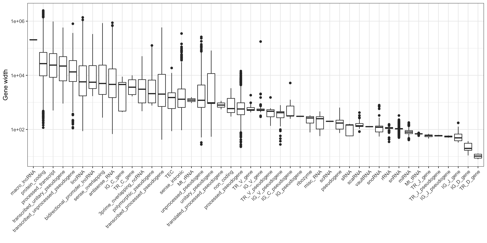
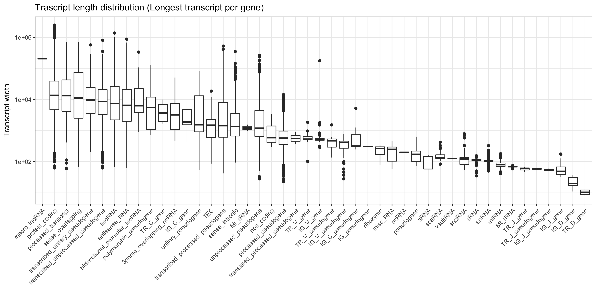

Gencode Annotation Processing
================
Federico Agostini
January 9, 2018

## Setup

    ## R version 3.4.3 (2017-11-30)

    ## Platform x86_64-apple-darwin15.6.0 (64-bit)

    ## Running under OS X El Capitan 10.11.6

    ## Last knitted on Wed Jan 17 17:38:24 2018

    ## Working directory set to /Users/agostif/Desktop/GencodeReference

    ## Species:  Homo sapiens

    ## Genome assembly: hg38

    ## Gencode version: 27

If any of the information above does not suit your needs, please review
it in the ‘setup’ chunk and re-run the script.

## Gencode Annotation (GFF3)

### Input

If they are not present in the working folder, the pipeline will
download the following files:

  - **Comprehensive gene annotation**: It contains the comprehensive
    gene annotation on the reference chromosomes only.
  - **Long non-coding RNA gene annotation**: It contains the
    comprehensive gene annotation of lncRNA genes on the reference
    chromosomes (this is a subset of the main annotation file);
  - **Predicted tRNA genes**: tRNA genes predicted by ENSEMBL on the
    reference chromosomes using tRNAscan-SE (this dataset does not form
    part of the main annotation file);
  - **Chromosome sizes**: The file contains the size in nucleorides of
    each chromosome.

**Note**: the pipeline will search for the genome assembly and Gencode
annotation versions specified within the script. Therefore, if you plan
to use a different species/assembly/annotation make sure you change the
script accordingly.

| Biotype                              |    1 |     2 |    3 |
| :----------------------------------- | ---: | ----: | ---: |
| protein\_coding                      | 5582 | 14215 |   21 |
| processed\_pseudogene                | 8033 |  2199 |    1 |
| lincRNA                              | 1099 |  6393 |    1 |
| antisense\_RNA                       |  908 |  4609 |    0 |
| unprocessed\_pseudogene              |  427 |  2210 |    0 |
| misc\_RNA                            |    0 |     0 | 2212 |
| snRNA                                |    0 |     1 | 1899 |
| miRNA                                |    0 |     0 | 1879 |
| TEC                                  |    1 |  1065 |    0 |
| snoRNA                               |    0 |     8 |  935 |
| sense\_intronic                      |   68 |   836 |    0 |
| transcribed\_unprocessed\_pseudogene |  122 |   706 |    0 |
| processed\_transcript                |   73 |   470 |    0 |
| rRNA                                 |    0 |     0 |  543 |
| transcribed\_processed\_pseudogene   |  322 |   140 |    0 |
| sense\_overlapping                   |   17 |   172 |    0 |
| IG\_V\_pseudogene                    |   35 |   153 |    0 |
| IG\_V\_gene                          |    0 |   144 |    0 |
| transcribed\_unitary\_pseudogene     |   20 |    91 |    0 |
| TR\_V\_gene                          |    0 |   108 |    0 |

The *Comprehensive gene annotation* file is employed to extract
information on genes, transcripts and exons, while the *Long non-coding
RNA gene annotation* is used to include additional non-coding RNAs
(assigned as such by Gencode) to those predicted using sequences from
[Rfam](http://rfam.xfam.org/) and [miRBase](http://www.mirbase.org/).

By default, the analysis is restricted to standard chromosome only, and
to level 1 (validated), 2 (manual annotation) and 3 (automated
annotation) genes.

### Output

  - **&lt;genome&gt;\_Gencode&lt;version&gt;\_annotations.RData**: It contains
    most of the annotation objects, including genes, transcripts and
    exons GRanges, genes and transcripts metadata, and longest pre- and
    mature RNA
    GRanges.
  - **&lt;genome\>\_Gencode&lt;version&gt;\_annotations.pc.transcript.regions.RData**:
    It contains protein-coding genes GRanges sub-divided into 5’-UTR,
    exonic and 3’-UTR
    regions.
  - **&lt;genome&gt;\_Gencode&lt;version&gt;\_annotations.all.genes.transcript.regions.RData**:
    It contains all the annotated features, where each annotated
    nucleotide is assigned to a transcript biotype using the following
    hierarchy: ncRNA &gt; cds &gt; utr3 &gt; utr5 &gt; intron &gt; other &gt;
    intergenic.

| Region | Min. | 1st Qu. | Median |   Mean | 3rd Qu. |   Max. | Coverage |
| :----- | ---: | ------: | -----: | -----: | ------: | -----: | -------: |
| UTR5   |    1 |      97 |    206 |  296.0 |     374 |   7720 |  5598828 |
| CDS    |    8 |     738 |   1233 | 1670.9 |    2013 | 107976 | 33463040 |
| UTR3   |    1 |     389 |   1031 | 1725.1 |    2338 |  32870 | 32878861 |

| Region | Min. | 1st Qu. | Median |   Mean | 3rd Qu. |   Max. |   Coverage |
| :----- | ---: | ------: | -----: | -----: | ------: | -----: | ---------: |
| ncRNA  |    2 |      91 |    141 |  297.8 |   266.0 | 205012 |   40928476 |
| CDS    |    1 |      80 |    121 |  174.4 |   172.0 |  21693 |   28517368 |
| UTR3   |    1 |     181 |    549 | 1201.9 |  1541.2 |  32870 |   33513951 |
| UTR5   |    1 |      57 |    117 |  183.0 |   227.0 |   5545 |    7701216 |
| intron |    1 |     448 |   1418 | 5226.2 |  3982.0 | 767751 | 1164023803 |
| other  |    1 |     487 |   1436 | 7650.7 |  5771.0 | 602638 |  435119605 |
