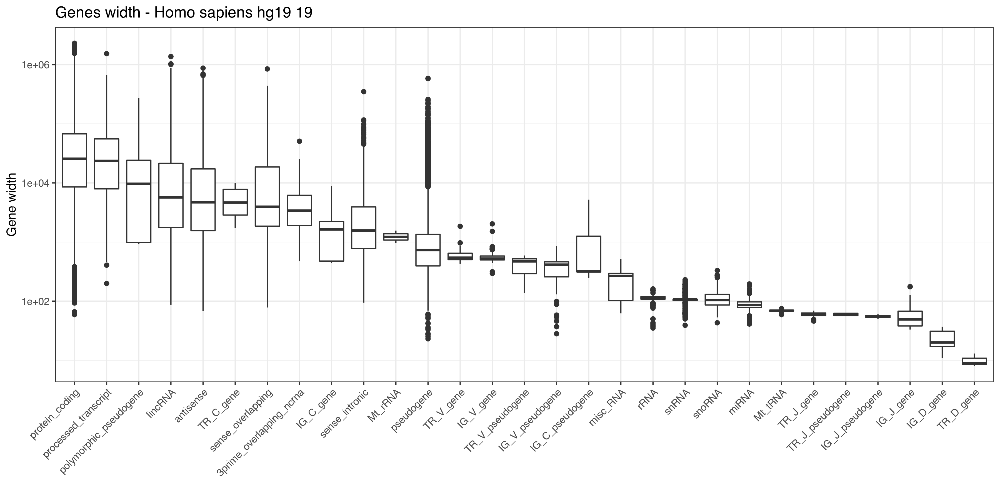
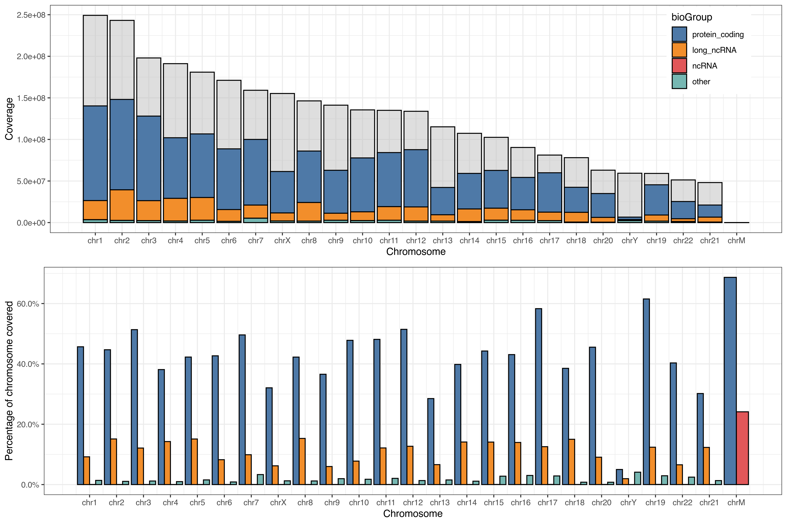

## To-Do

  - Merge the rRNA (and Mt\_RNA) genes from the main annotation with the
    predicted tRNA genes

## Setup

    ## R version 3.6.1 (2019-07-05)

    ## Platform x86_64-pc-linux-gnu (64-bit)

    ## Running under Ubuntu 18.04.3 LTS

    ## Last knitted on Fri Aug 23 11:43:55 2019

    ## Species:  Homo sapiens

    ## Genome assembly: hg19

    ## Gencode version: 19

If any of the information above does not suit your needs, please review
it in the ‘setup’ chunk and re-run the script.

## Gencode Annotation (GFF3)

### Input

If they are not present in the working folder, the pipeline will
download the following files:

  - **Comprehensive gene annotation**: It contains the comprehensive
    gene annotation on the reference chromosomes only.
  - **Long non-coding RNA gene annotation**: It contains the
    comprehensive gene annotation of lncRNA genes on the reference
    chromosomes (this is a subset of the main annotation file);
  - **Predicted tRNA genes**: tRNA genes predicted by ENSEMBL on the
    reference chromosomes using tRNAscan-SE (this dataset does not form
    part of the main annotation file);
  - **Chromosome sizes**: The file contains the size in nucleorides of
    each chromosome.

**Note**: the pipeline will search for the genome assembly and Gencode
annotation versions specified within the script. Therefore, if you plan
to use a different species/assembly/annotation make sure you change the
script accordingly.

##### Table 1: Gene biotypes (top 20) per annotation level

| Biotype         |    1 |     2 |    3 |
| :-------------- | ---: | ----: | ---: |
| protein\_coding | 5165 | 14614 |  548 |
| pseudogene      | 8823 |  4791 |  306 |
| lincRNA         | 1010 |  6097 |    2 |
| antisense       |  852 |  4421 |    0 |
| miRNA           |    0 |     6 | 3043 |
| misc\_RNA       |    0 |     2 | 2031 |
| snRNA           |    0 |     5 | 1911 |
| snoRNA          |    0 |     8 | 1449 |
| sense\_intronic |   64 |   677 |    0 |
| rRNA            |    0 |     0 |  526 |

The *Comprehensive gene annotation* file is employed to extract
information on genes, transcripts and exons, while the *Long non-coding
RNA gene annotation* is used to include additional non-coding RNAs
(assigned as such by Gencode) to those predicted using sequences from
[Rfam](http://rfam.xfam.org/) and [miRBase](http://www.mirbase.org/).

By default, the analysis is restricted to standard chromosome only, and
to level 1 (validated), 2 (manual annotation) and 3 (automated
annotation)
    genes.

### Output

  - **\<genome\>\_Gencode\<version\>\_genes\_annotations\_minimal.RData**:
    It contains the basic annotation objects, including genes GRanges
    and metadata information.

  - **\<genome\>\_Gencode\<version\>\_txs\_annotations\_minimal.RData**:
    It contains the basic annotation objects, including transcripts
    GRanges and metadata information.

  - **\<genome\>\_Gencode\<version\>\_genes\_annotations.RData**: In
    addition to the minimal object, it contains exons GRanges and
    separate protein-coding and non-coding genes and exons GRanges.

  - **\<genome\>\_Gencode\<version\>\_txs\_annotations.RData**: In
    addition to the minimal object, it contains exons GRanges and
    separate protein-coding and non-coding longest transcripts and exons
    GRanges. These are further divided into ‘pre’ (nascent) and ‘rna’
    (mature)
    transcripts.

  - **\<genome\>\_Gencode\<version\>\_annotations.pc.transcript.regions.rds**:
    It contains protein-coding genes GRanges sub-divided into 5’-UTR,
    exonic and 3’-UTR
    regions.

  - **\<genome\>\_Gencode\<version\>\_annotations.all.genes.transcript.regions.rds**:
    It contains all the annotated features, where each annotated
    nucleotide is assigned to a transcript biotype using the following
    hierarchy: ncRNA \> cds \> utr3 \> utr5 \> intron \> other \>
    intergenic

##### Figure 1: Gene length distribution

##### Figure 2: Trascript length distribution (Longest transcript per gene)

##### Table 2: Summary of the non-overlapping protein-coding regions

| Region | Min. | 1st Qu. | Median |   Mean | 3rd Qu. |   Max. | Coverage |
| :----- | ---: | ------: | -----: | -----: | ------: | -----: | -------: |
| UTR5   |    1 |      95 |    204 |  300.7 |     375 |  14960 |  5746629 |
| CDS    |    8 |     687 |   1191 | 1619.2 |    1965 | 107976 | 33280413 |
| UTR3   |    1 |     355 |    933 | 1517.0 |    2061 |  22552 | 29321630 |

##### Figure 3: Gene density across chromosomes

##### Table 3: Summary of all non-overlapping genomic regions (by gene)

| Group           | Region            | Min. | 1st Qu. | Median |   Mean | 3rd Qu. |   Max. |   Coverage |
| :-------------- | :---------------- | ---: | ------: | -----: | -----: | ------: | -----: | ---------: |
| ncRNA           | exon              |    1 |    87.0 |  104.0 |  125.2 |   121.0 |   1559 |    1110549 |
| long\_ncRNA     | exon              |    1 |   103.0 |  178.0 |  383.0 |   362.0 |  91667 |   17231198 |
| long\_ncRNA     | intron            |    1 |   647.0 | 2147.0 | 9225.7 |  7837.0 | 409122 |  320169286 |
| protein\_coding | CDS               |    1 |    82.0 |  121.0 |  168.6 |   171.0 |  21693 |   35239515 |
| protein\_coding | five\_prime\_UTR  |    1 |    67.0 |  128.0 |  198.8 |   240.0 |  14960 |    9098634 |
| protein\_coding | three\_prime\_UTR |    1 |   113.0 |  367.0 |  935.6 |  1169.0 |  22552 |   33261185 |
| protein\_coding | intron            |    1 |   475.2 | 1494.0 | 5387.0 |  4203.0 | 657297 | 1179276593 |
| protein\_coding | exon              |    1 |    86.0 |  176.0 |  321.4 |   350.0 |  24177 |   16342578 |
| protein\_coding | UTR               |    4 |    71.2 |  111.5 |  353.7 |   161.8 |  15046 |      72864 |
| other           | exon              |    1 |   120.0 |  238.0 |  426.0 |   541.0 |  12496 |   11727581 |
| other           | intron            |    1 |   309.0 |  829.0 | 2666.0 |  2273.0 | 311063 |   34537801 |
| other           | CDS               |    4 |    96.0 |  136.0 |  191.8 |   181.0 |   1859 |      73467 |
| other           | three\_prime\_UTR |   10 |   121.5 |  314.0 |  604.8 |   762.0 |   3328 |      18750 |
| other           | five\_prime\_UTR  |    2 |    35.0 |   89.0 |   98.0 |   123.0 |    352 |       3235 |

##### Table 4: Summary of all non-overlapping genomic regions (by transcript)

| Region      | Min. | 1st Qu. | Median |   Mean | 3rd Qu. |   Max. |   Coverage |
| :---------- | ---: | ------: | -----: | -----: | ------: | -----: | ---------: |
| ncRNA       |   35 |      87 |    104 |  125.4 |   121.0 |   2728 |    1147867 |
| CDS         |    1 |      84 |    123 |  170.7 |   172.0 |  21693 |   35101038 |
| UTR3        |    1 |     188 |    541 | 1116.8 |  1460.5 |  22552 |   31846862 |
| UTR5        |    1 |      67 |    126 |  196.9 |   238.0 |  14960 |    8998336 |
| long\_ncRNA |    1 |      91 |    160 |  325.2 |   317.0 |  91667 |   24356623 |
| intron      |    1 |     449 |   1425 | 5247.9 |  3995.0 | 728468 | 1162213235 |
| other       |    1 |     472 |   1350 | 7480.1 |  5488.5 | 602638 |  393624369 |
